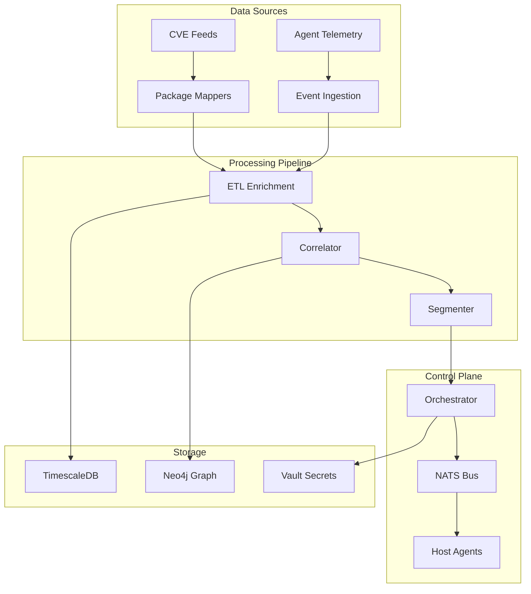

# AegisFlux

[](https://opensource.org/licenses/BSD-2-Clause)
[](https://golang.org/)
[](https://www.docker.com/)

> **Backend Control Plane for Adaptive Security**  
> AegisFlux coordinates host agents, ingests threat intelligence, and delivers **segmentation and adaptive safeguards** to Linux hosts via **eBPF map snapshots**.

---

## 🎯 Overview

AegisFlux is the **backend control plane** for the Aegis ecosystem, providing:

- **🛡️ Adaptive Security**: Dynamic segmentation policies based on real-time threat intelligence
- **📊 Threat Intelligence**: CVE and package feed ingestion with enrichment pipelines  
- **🔄 Event Processing**: Real-time event correlation and analysis
- **🎛️ Orchestration**: Centralized control plane for distributed eBPF agents
- **📈 Observability**: Comprehensive telemetry and monitoring

---

## 🏗️ Architecture

### Core Components



### Service Topology

| Service | Purpose | Port | Status |
|---------|---------|------|--------|
| **Orchestrator** | REST API, MapSnapshot compilation | 8081 | ✅ Implemented |
| **Segmenter** | Policy proposal and planning | 8086 | ✅ Implemented |
| **NATS** | Event bus and messaging | 4222 | ✅ Implemented |
| **ETL-Enrich** | Event enrichment pipeline | 8082 | 🚧 In Progress |
| **Correlator** | Rules engine and correlation | 8083 | 🚧 In Progress |
| **Decision** | AI-powered decision making | 8084 | 🚧 In Progress |
| **Ingest** | Agent telemetry ingestion | 8085 | 🚧 In Progress |

---

## 🚀 Quick Start

### Prerequisites

- Docker & Docker Compose
- Go 1.21+ (for development)
- NATS server (included in compose)

### Development Setup

1. **Clone the repository**
   ```bash
   git clone https://github.com/sgerhart/aegisflux.git
   cd aegisflux
   ```

2. **Start the core services**
   ```bash
   docker compose up -d
   ```

3. **Verify services are running**
   ```bash
   # Check orchestrator health
   curl -s localhost:8081/healthz
   
   # Check segmenter health  
   curl -s localhost:8086/healthz
   
   # Monitor NATS messages
   nats sub "actions.seg.maps" -s nats://localhost:4222
   ```

4. **Test the API**
   ```bash
   # Send a sample MapSnapshot
   bash scripts/post_maps.sh
   
   # Or use the example script
   ./backend/orchestrator/example_usage.sh
   ```

---

## 📋 API Reference

### Orchestrator API

#### `POST /seg/maps`
Submit a MapSnapshot for processing and distribution.

**Request Body:**
```json
{
  "version": 1,
  "service_id": 101,
  "edges": [
    {"dst_cidr": "10.10.20.0/24", "proto": "tcp", "port": 5432},
    {"dst_cidr": "10.10.30.15/32", "proto": "tcp", "port": 443}
  ],
  "allow_cidrs": [
    {"cidr": "0.0.0.0/0", "proto": "tcp", "port": 22}
  ],
  "ttl_seconds": 1800,
  "meta": {"note": "canary segmentation for service:web"}
}
```

**Query Parameters:**
- `target_host` (optional): Comma-separated list of target hosts

**Response:**
```json
{
  "accepted": true,
  "service_id": 101,
  "target_hosts": ["host1", "host2"],
  "timestamp": 1640995200
}
```

#### `POST /seg/maps/promote`
Promote a segmentation plan to production.

#### `POST /seg/maps/rollback`
Rollback a segmentation plan.

#### `GET /healthz`
Health check endpoint.

### Segmenter API

#### `POST /segment/propose`
Propose new segmentation policies based on service flows.

#### `POST /segment/plan`
Convert proposals into executable MapSnapshot plans.

---

## 📊 MapSnapshot Schema

The `MapSnapshot` is the core data structure that flows from the orchestrator to host agents:

```json
{
  "$schema": "http://json-schema.org/draft-07/schema#",
  "title": "MapSnapshot",
  "type": "object",
  "properties": {
    "version": {"type": "integer", "minimum": 1},
    "service_id": {"type": "integer", "minimum": 0},
    "edges": {
      "type": "array",
      "items": {
        "type": "object",
        "properties": {
          "dst_cidr": {"type": "string"},
          "proto": {"type": "string", "enum": ["tcp", "udp", "any"]},
          "port": {"type": "integer", "minimum": 0, "maximum": 65535}
        },
        "required": ["dst_cidr", "proto", "port"]
      }
    },
    "allow_cidrs": {
      "type": "array",
      "items": {
        "type": "object",
        "properties": {
          "cidr": {"type": "string"},
          "proto": {"type": "string", "enum": ["tcp", "udp", "any"]},
          "port": {"type": "integer", "minimum": 0, "maximum": 65535}
        },
        "required": ["cidr", "proto", "port"]
      }
    },
    "ttl_seconds": {"type": "integer", "minimum": 60},
    "meta": {"type": "object"}
  },
  "required": ["version", "service_id", "ttl_seconds"]
}
```

---

## 🛠️ Development

### Project Structure

```
aegisflux/
├── backend/                 # Backend services
│   ├── orchestrator/       # MapSnapshot orchestration
│   ├── segmenter/          # Policy planning
│   ├── etl-enrich/         # Event enrichment
│   ├── correlator/         # Rules engine
│   ├── decision/           # AI decision making
│   └── ingest/             # Telemetry ingestion
├── agents/                 # Host agents
│   ├── local-agent/        # eBPF agent
│   └── ebpf-sensor/        # eBPF sensor
├── bpf-templates/          # eBPF program templates
├── schemas/                # JSON schemas
├── prompts/                # Development prompts
├── infra/                  # Infrastructure configs
└── docs/                   # Documentation
```

### Development Workflow

We use **Cursor prompts** to guide incremental feature development:

1. **Feature Planning**: See `prompts/` for step-by-step implementation tasks
2. **API Development**: Implement REST endpoints with proper validation
3. **Integration Testing**: Test end-to-end flows with Docker Compose
4. **Documentation**: Update README and API docs

### Key Development Tasks

- [x] **Orchestrator `/seg/maps`** → NATS publishing with schema validation
- [x] **Segmenter** → Policy proposal and planning endpoints
- [ ] **End-to-end roundtrip** → Orchestrator → NATS → Agent → eBPF updates
- [ ] **CVE integration** → Package mapping and threat intelligence
- [ ] **Correlator** → Rules engine with temporal joins
- [ ] **UI/Console** → Operator interface and visualization

---

## 🧪 Testing

### Run Tests

```bash
# Run all tests
go test ./...

# Run specific service tests
go test ./backend/orchestrator/... -v

# Run with coverage
go test -cover ./...
```

### Integration Testing

```bash
# Start test environment
docker compose up -d

# Run integration tests
./test_cap5_e2e.sh

# Clean up
docker compose down
```

---

## 🔮 Roadmap

### Phase 1: Core Platform ✅
- [x] Orchestrator with MapSnapshot API
- [x] Segmenter with policy planning
- [x] NATS event bus integration
- [x] Schema validation and testing

### Phase 2: Intelligence Pipeline 🚧
- [ ] CVE feed integration and package mapping
- [ ] Event enrichment with threat intelligence
- [ ] Rules-based correlation engine
- [ ] Temporal analysis and scoring

### Phase 3: Advanced Features 📋
- [ ] Autonomous plan promotion/rollback
- [ ] Graph database integration (Neo4j)
- [ ] Real-time visualization UI
- [ ] Machine learning-based policy optimization

### Phase 4: Production Ready 🎯
- [ ] High availability and clustering
- [ ] Advanced monitoring and alerting
- [ ] Security hardening and compliance
- [ ] Performance optimization

---

## 🤝 Contributing

1. Fork the repository
2. Create a feature branch (`git checkout -b feature/amazing-feature`)
3. Commit your changes (`git commit -m 'Add amazing feature'`)
4. Push to the branch (`git push origin feature/amazing-feature`)
5. Open a Pull Request

### Development Guidelines

- Follow Go best practices and conventions
- Add tests for new features
- Update documentation for API changes
- Use conventional commit messages

---

## 📄 License

This project is licensed under the **Dual BSD/GPL License** - see the [LICENSE](LICENSE) file for details.

The dual license accommodates eBPF kernel license requirements while providing flexibility for different use cases.

---

## 📞 Support

- **Documentation**: See `docs/` directory
- **Issues**: [GitHub Issues](https://github.com/sgerhart/aegisflux/issues)
- **Discussions**: [GitHub Discussions](https://github.com/sgerhart/aegisflux/discussions)

---

## 🙏 Acknowledgments

- **eBPF Community** for the powerful kernel programming framework
- **NATS** for lightweight, high-performance messaging
- **Open Source Contributors** who make this project possible

---

<div align="center">

**AegisFlux** — *Adaptive Security for the Modern Cloud*

[⭐ Star this repo](https://github.com/sgerhart/aegisflux) • [🐛 Report Bug](https://github.com/sgerhart/aegisflux/issues) • [💡 Request Feature](https://github.com/sgerhart/aegisflux/issues)

</div>